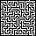
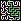
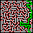

# MazeSolver
A practise project in java and datastructures

The project is made for solving pictures of mazes. The mazes are defined by having one pixel wide black walls
and one pixel wide white paths. The whole image is bordered with a one pixel wide black border with a white 
hole in the top and bottom edge. The graph is made by finding potential nodes which are defined as corners of paths.
The connected nodes are then solved finding a path from the top to the bottom of the maze and drawn.

A new maze:   Solved 5x5 maze: 
Solved 10x10 maze: Solved 100x100 maze: 

The red spots are marked potential nodes and the green lines are the paths leading from the entry to the exit.

# Modules
## [Image](src/main/java/image)
This module is used for parsing and getting the maze from an image.

ImagePixelArray is used to convert the image to an array containing int values for pixels.

ImageDrawer is used to draw on the maze with the data from the given path of position nodes.

## [Maze](src/main/java/maze)
This modulse is used for converting the parsed image to connected nodes.

MazeImage loads the given maze image applyes ImagePixelArray and returns the image.

MazeGraph takes the array of pixels and finds potential nodes and connects them.

MazeMaker makes a whole new iamge of a maze

## [Graph](src/main/java/graph)
This module is used to define and implement the search algorithms using a node graph.

PositionNode contains the logic for a node with a given position.

SolveGraph finds the path of the given graph of Nodes given a defined predicate.
